# Entity Relationship Diagram: core shared entities

Owner: `data-architect`. Status: draft v0.1 (2026-09-27), Phase 0.

Scope: the shared core only. Module-owned tables (credentialing, enrollment,
screening, governance, FTCA/risk, scope, contracts, finance, quality,
experience, learning) attach to `person`, `site`, `requirement_instance`, and
`evidence_version` and get their own diagrams.

Conventions that apply to every table below (not repeated in the diagram):

- Every tenant-scoped table has `organization_id uuid NOT NULL` and a forced
  RLS policy (ADR-0002). Catalog tables (`catalog_release`, `requirement`,
  `requirement_version`) are global and read-only to tenants.
- Business records carry `created_at`, `created_by`, `updated_at`,
  `updated_by`, and `archived_at` (soft delete). Timestamps are UTC.
- Temporal rows (`staff_assignment`, `provider_profile`, `board_membership`,
  `contractor_contact`, `evidence_version`) use `valid_from` / `valid_to` and are
  never overwritten; a change closes the old row and opens a new one.
- `enc` = application-level field encryption (ADR-0007); `bidx` = keyed
  blind-index hash for search.
- **No SSN column exists anywhere (decision D1).** Persons are matched on name,
  DOB, NPI, and license number.
- Florida only (D4): addresses are validated to FL; `site.time_zone` is
  `America/New_York` or `America/Chicago`.
- Audit design is in ADR-0008.

```mermaid
erDiagram
    organization ||--o{ site : operates
    organization ||--o{ department : has
    organization ||--o{ person : "employs or engages"
    site ||--o{ department : hosts

    person ||--o{ staff_assignment : "works as"
    person ||--o| provider_profile : "practices as"
    person ||--o{ board_membership : "serves as"
    person ||--o{ contractor_contact : "represents"
    department ||--o{ staff_assignment : staffs
    site ||--o{ staff_assignment : "located at"

    catalog_release ||--o{ requirement_version : publishes
    requirement ||--o{ requirement_version : "versioned as"
    requirement_version ||--o{ requirement_instance : "applied as"
    organization ||--o{ requirement_instance : "subject of"

    evidence ||--o{ evidence_version : "versioned as"
    evidence_version ||--o{ evidence_requirement_link : satisfies
    requirement_instance ||--o{ evidence_requirement_link : "satisfied by"

    requirement_instance ||--o{ task : generates
    workflow_definition ||--o{ workflow_run : instantiates
    workflow_run ||--o{ task : contains
    workflow_run ||--o{ approval : records
    person ||--o{ task : "assigned to"
    person ||--o{ approval : decides
    person ||--o{ notification : receives

    organization ||--o{ readiness_snapshot : "trended in"
    catalog_release ||--o{ readiness_snapshot : "evaluated against"
    organization ||--o{ audit_event : "chained in"
    organization ||--|| audit_chain_head : "head of"

    organization {
        uuid id PK
        text legal_name
        text award_type "section_330 | look_alike"
        text[] sub_programs "CHC MHC HCH PHPC"
        text grant_number
        text time_zone "America/New_York | America/Chicago"
        boolean is_public_agency "FL-D3; turns on FL-SUNSHINE"
        text state "FL only (D4)"
        timestamptz archived_at
    }
    site {
        uuid id PK
        uuid organization_id FK
        text name
        text form_5b_site_id "links to Form 5B"
        text site_type
        text address_line1
        text city
        text state "FL"
        text postal_code
        text time_zone
        date valid_from
        date valid_to
        timestamptz archived_at
    }
    department {
        uuid id PK
        uuid organization_id FK
        uuid site_id FK "nullable: org-wide"
        text name
        timestamptz archived_at
    }
    person {
        uuid id PK
        uuid organization_id FK
        text given_name
        text family_name
        text preferred_name
        text work_email
        bytea dob_enc "enc"
        bytea dob_bidx "bidx"
        bytea home_address_enc "enc"
        text npi "nullable"
        boolean is_test_record "synthetic seed flag"
        uuid identity_user_id "SSO account (ADR-0006)"
        timestamptz archived_at
    }
    staff_assignment {
        uuid id PK
        uuid organization_id FK
        uuid person_id FK
        uuid site_id FK
        uuid department_id FK
        text job_title
        text staff_type "LIP OLCP clinical_staff admin"
        text employment_type "employee | contractor | volunteer"
        date valid_from
        date valid_to
        timestamptz archived_at
    }
    provider_profile {
        uuid id PK
        uuid organization_id FK
        uuid person_id FK
        text npi
        text provider_type
        text specialty
        bytea dea_number_enc "enc"
        bytea dea_number_bidx "bidx"
        date valid_from
        date valid_to
        timestamptz archived_at
    }
    board_membership {
        uuid id PK
        uuid organization_id FK
        uuid person_id FK
        text seat_role "chair treasurer member"
        boolean is_patient_member "Ch. 20 composition"
        boolean represents_populations
        date term_start
        date term_end
        date valid_from
        date valid_to
        timestamptz archived_at
    }
    contractor_contact {
        uuid id PK
        uuid organization_id FK
        uuid person_id FK
        uuid contract_id "FK to contracts module"
        text role
        date valid_from
        date valid_to
        timestamptz archived_at
    }
    catalog_release {
        uuid id PK
        text version "semver"
        date effective_date
        timestamptz published_at
        text source_register_hash
    }
    requirement {
        text id PK "stable requirementId"
        text module
        text jurisdiction "HRSA | FL"
    }
    requirement_version {
        uuid id PK
        text requirement_id FK
        uuid catalog_release_id FK
        int version
        text title_en
        text title_es
        jsonb applicability "award type, sub-program, site type, staff type"
        text cadence
        jsonb citations "chapter or CFR or PAL, verified_on"
        date effective_from
        date effective_to
    }
    requirement_instance {
        uuid id PK
        uuid organization_id FK
        uuid requirement_version_id FK
        text subject_type "organization site person contract ..."
        uuid subject_id
        uuid owner_person_id FK
        text status "met due_soon overdue missing not_applicable"
        text not_applicable_reason
        date next_due_on
        timestamptz archived_at
    }
    evidence {
        uuid id PK
        uuid organization_id FK
        text title
        text evidence_type
        uuid current_version_id FK
        boolean legal_hold
        timestamptz archived_at
    }
    evidence_version {
        uuid id PK
        uuid organization_id FK
        uuid evidence_id FK
        int version_no
        text object_key
        bytea sha256
        bigint size_bytes
        text mime_type
        jsonb structured_fields
        text source "upload | integration | attestation"
        uuid source_ref
        date valid_from
        date valid_to
        uuid submitted_by FK
        timestamptz created_at
    }
    evidence_requirement_link {
        uuid organization_id FK
        uuid evidence_version_id FK
        uuid requirement_instance_id FK
        date linked_from
        date linked_to
    }
    workflow_definition {
        uuid id PK
        uuid organization_id FK "nullable: platform template"
        text key
        int version
        jsonb steps
    }
    workflow_run {
        uuid id PK
        uuid organization_id FK
        uuid workflow_definition_id FK
        text subject_type
        uuid subject_id
        text state
        timestamptz started_at
        timestamptz completed_at
    }
    task {
        uuid id PK
        uuid organization_id FK
        uuid workflow_run_id FK
        uuid requirement_instance_id FK
        uuid assignee_person_id FK
        text title
        date due_on
        text status
        timestamptz archived_at
    }
    approval {
        uuid id PK
        uuid organization_id FK
        uuid workflow_run_id FK
        uuid approver_person_id FK "human only; AI never approves"
        text decision "approved rejected"
        text comment
        timestamptz decided_at
    }
    notification {
        uuid id PK
        uuid organization_id FK
        uuid recipient_person_id FK
        text channel "in_app | email"
        text template_key
        timestamptz sent_at
        timestamptz read_at
    }
    readiness_snapshot {
        uuid id PK
        uuid organization_id FK
        uuid catalog_release_id FK
        date as_of
        jsonb scores "by module, site, requirement"
        timestamptz computed_at
    }
    audit_event {
        uuid id PK
        uuid organization_id FK
        bigint chain_seq
        timestamptz occurred_at "partition key, monthly"
        text category
        text action
        uuid actor_person_id
        text target_table
        uuid target_id
        jsonb diff "redacted"
        bytea prev_hash
        bytea row_hash
    }
    audit_chain_head {
        uuid organization_id PK
        bigint chain_seq
        bytea row_hash
    }
```

## Notes and open items

- The many-to-many between `evidence_version` and `requirement_instance` is
  `evidence_requirement_link`, which is itself temporal so we can answer "what
  evidence supported this requirement on date X".
- `requirement_instance.subject_type/subject_id` is polymorphic; integrity is
  enforced by a check trigger per subject type rather than a foreign key.
  To revisit if it proves fragile.
- `person.npi` and `provider_profile.npi` overlap; decide in the data
  dictionary whether NPI lives only on `provider_profile`.
- Seed NPIs are Luhn-valid (with the `80840` prefix) and rows carry
  `is_test_record = true`.
- Sensitivity classes per column go in the data dictionary (next deliverable,
  template from `security-privacy-officer`).
